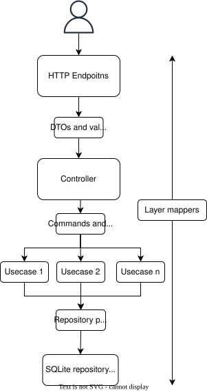
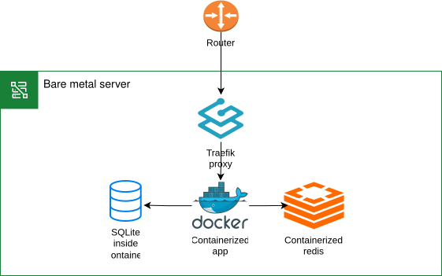
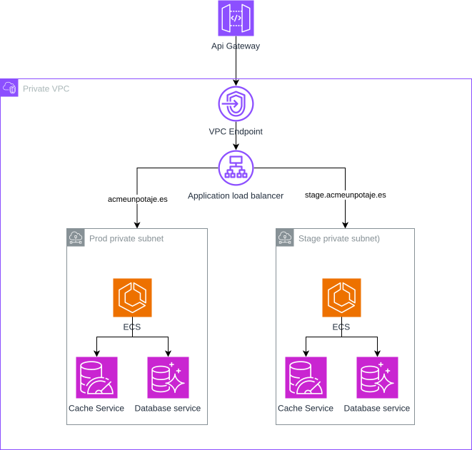
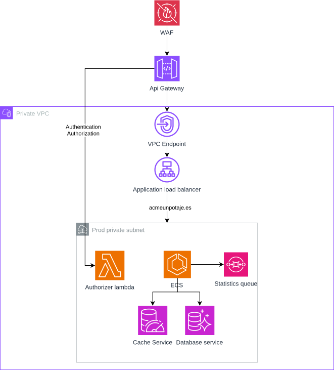

<p align="center">
  
</p>

<h1 align="center">Acme-Unpuchero</h1>

A next-generation API (or something like that) for a next-generation restaruant management system (or something like that).

<details>
  <summary>Spoiler warning</summary>
  
  This is a technical assessment for the role of Senior Backend Developer at Tailor. It is a RESTful API built with NestJS and TypeScript. This is not next-generation nothing, this is not real, don't use it for anything 🫶.
</details>

<p align="center">
<a href="https://nestjs.com/" target="_blank"></a>
<a href="https://pnpm.io/" target="_blank"></a>
<a href="https://swagger.io/" target="_blank"></a>
</p>
<p align="center">
<a href="https://app.codecov.io/gh/alesanmed-forked-projects/senior-backend-challenge" >

</a>

</p>
<p align="center">
<a href="https://app.codecov.io/gh/alesanmed-forked-projects/senior-backend-challenge"></a>
</p>

## How to use the app?

This app is deployed in the following URL: https://acme-un-puchero.alesanmed.com

You can test the app using the following credentials:

- Email: admin@example.com
- Password: The one set by default in swagger login request.

The password is the same for every user. The availabe user emails are:

- steve@example.com
- morgan@example.com
- jason@example.com
- steph@example.com
- sam@example.com
- zs@example.com
- emily@example.com
- allen@example.com
- david@example.com
- raymond@example.com
- laurel@example.com

## How is this app built?

This project is a RESTful API built with NestJS and TypeScript. The architecture is based on [Hexagonal Architecture](<https://en.wikipedia.org/wiki/Hexagonal_architecture_(software)>). A general overview is shown in the following diagram:

<p align="center">
  
</p>

The user makes an http request to the endpoint. After that, some validations are performe using the DTO. The final object is passed to the controller. The controller calls the necessary usecases to perform the action required by the endpoint.

The information needed by the usecase is passed using queries and command objects (just containing information, no logic). The usecase performs (if needed) some business logic and then calls the repository.

Finally, the response is returned to the user.

Throughout this process, the data is transformed between the different layers using mappers.

### Modules and their responsibilities

The project is divided into the following modules:

- Auth: Handles the authentication and authorization of the users.
- Users: Handles the users and their favorites.
- Restaurants: Handles the restaurants of the system.
- Reviews: Handles the reviews of the system.
- Dashboard: Handles the statistics of the system.

Each module has its own repository, usecases, controllers, and DTOs.

## What are the app components?

The app doesn't have a lot of moving parts, but there a few important ones:

- The database: A SQLite database is used to store the app data.
- The cache: By default, the app uses an in-memory cache. But when running un production mode, there is a Redis key-value store as fallback.
- The authentication: JWT is used to authenticate the users.
- The authorization: Role-based access control is used to authorize the users.
- The logging: Pino is used to log the events of the app.

## How is the app deployed?

Here is a basic diagram of the current app deployment:

<p align="center">
  
</p>

The app is deployed in a Bare Metal server using docker compose. The server is hosted in a private network.

The app itself doesn't implement any kind of balancing nor rate limiting. This is handled at the proxy layer. In this case, Traefik implements a rate limiter with the following configuration:

```toml
[http.middlewares]
  [http.middlewares.rate-limited.rateLimit]
    average = 100
    period = "1s"
    burst = 200
```

This middleware is applied to all requets coming to Traefik.

## App future deployments

While this deployment currently works, in a real environment there is little to no chance that it will be used as is. Normally you would deploy this in a cloud environment with proper horizontal scaling.

### Basic proposal

Here is a basic proposal for a future deployment:

<p align="center">
  
</p>

This app assumes AWS for simplicity, but any other cloud provider would work.

The app would be deployued in a private subnet per environment (development, staging, production). All of those subnets would be in the same VPC.

Inside the subnet, the app would be deployed using ECS, thus allowing automatic horizontal scaling. The main change here would be the database. Since the app uses SQLite and we want multiple instances of the app to share the same database, we would need to use a database that supports multiple instances*. In this case, we would use RDS for PostgreSQL.

There would be also a cache store in the same subnet.

In front of the subnet, there would be a load balancer to distribute the traffic across the app instances.

Finally, there would be an API Gateway to route the traffic from the internet to the load balancer.

*This can be achieved using [rqlite](https://github.com/rqlite/rqlite), but for simplicity, we will use RDS for PostgreSQL.

### Second step

If the app is successful and we need to scale it even more, we could take the following approach:

<p align="center">
  
</p>

This proposal is built on top of the basic one. The main changes are:

- A WAF is added in front of the API Gateway to protect the app from common attacks. This would also implement the rate limiting.
- The authorization and authentication are moved to the API Gateway, using a lambda as an authorizer.
- A message queue is used to compute the statistics regularly in a background job.

These changes would allow the app to scale more easily in the future.

## Some performance metrics

Using the [current deployment](#how-is-the-app-deployed) and [k6](https://k6.io/), I performed some load tests to check how the app behaves under load.

First, the server specifications:
  - Intel(R) Core(TM) i5-10400 CPU @ 2.90GHz
  - 32 GB RAM
  - Gigabit Ethernet
  - Cat 6 cable

The container is limited to 512MB of memory and 2 CPUs. This means that the app can only use up to 2 cores at 2.90GHz.

First, I use a conservative scenario:
  - First stage: 30 seconds to ramp up to 25 users
  - Second stage: 1 minute to ramp up to 50 users
  - Third stage: 2 minutes to ramp up to 120 users
  - Fourth stage: 1 minute to ramp down to 50 users
  - Fifth stage: 30 seconds to cool down

The thresholds are:
  - 95% of requests < 500ms
  - 99% of requests < 1s
  - Less than 5% errors

The results are:

```bash

         /\      Grafana   /‾‾/
    /\  /  \     |\  __   /  /
   /  \/    \    | |/ /  /   ‾‾\
  /          \   |   (  |  (‾)  |
 / __________ \  |_|\_\  \_____/

     execution: local
        script: .\script.js
        output: -

     scenarios: (100.00%) 1 scenario, 120 max VUs, 5m30s max duration (incl. graceful stop):
              * default: Up to 120 looping VUs for 5m0s over 5 stages (gracefulRampDown: 30s, gracefulStop: 30s)

  █ THRESHOLDS

    http_req_duration
    ✓ 'p(95)<500' p(95)=337.91ms
    ✓ 'p(99)<1000' p(99)=726.54ms

    http_req_failed
    ✓ 'rate<0.05' rate=0.03%


  █ TOTAL RESULTS

    checks_total.......: 23956  78.487346/s
    checks_succeeded...: 99.97% 23951 out of 23956
    checks_failed......: 0.02%  5 out of 23956

    ✓ restaurants obtained
    ✓ has data
    ✓ restaurant obtained
    ✓ reviews obtained
    ✗ successful login
      ↳  99% — ✓ 2045 / ✗ 2
    ✗ token received
      ↳  99% — ✓ 2045 / ✗ 2
    ✓ successful registration
    ✓ favorites obtained
    ✓ favorite removed
    ✓ review created
    ✓ restaurant created by admin
    ✗ favorite added
      ↳  99% — ✓ 1020 / ✗ 1
    ✓ statistics obtained

    HTTP
    http_req_duration..............: avg=94.89ms min=502.6µs med=45.94ms max=3.6s   p(90)=232.15ms p(95)=337.91ms
      { expected_response:true }...: avg=94.88ms min=502.6µs med=45.92ms max=3.6s   p(90)=232.18ms p(95)=337.99ms
    http_req_failed................: 0.03%  6 out of 18899
    http_reqs......................: 18899  61.919033/s

    EXECUTION
    iteration_duration.............: avg=6.31s   min=1.16s   med=6.26s   max=13.81s p(90)=9.2s     p(95)=9.61s
    iterations.....................: 3012   9.868254/s
    vus............................: 1      min=1          max=120
    vus_max........................: 120    min=120        max=120

    NETWORK
    data_received..................: 589 MB 1.9 MB/s
    data_sent......................: 3.6 MB 12 kB/s


running (5m05.2s), 000/120 VUs, 3012 complete and 0 interrupted iterations
default ✓ [======================================] 000/120 VUs  5m0s
```

There were indeed some errors, 0.3% of the requests failed. For me, taking into account how "homemade" is the deployment and the app itself, this is acceptable. The app was able to handle the load while maintaining 95% of the requests under 500ms and 99% under 1s. The average response time was 94.89ms.

Then, I use a more aggressive scenario:
  - First stage: 30 seconds to ramp up to 50 users
  - Second stage: 1 minute to ramp up to 100 users
  - Third stage: 2 minutes to ramp up to 200 users
  - Fourth stage: 1 minute to ramp down to 100 users
  - Fifth stage: 30 seconds to cool down

The results are:

```bash

         /\      Grafana   /‾‾/  
    /\  /  \     |\  __   /  /   
   /  \/    \    | |/ /  /   ‾‾\ 
  /          \   |   (  |  (‾)  |
 / __________ \  |_|\_\  \_____/ 

     execution: local
        script: .\script.js
        output: -

     scenarios: (100.00%) 1 scenario, 200 max VUs, 5m30s max duration (incl. graceful stop):
              * default: Up to 200 looping VUs for 5m0s over 5 stages (gracefulRampDown: 30s, gracefulStop: 30s)

  █ THRESHOLDS

    http_req_duration
    ✗ 'p(95)<500' p(95)=2.42s
    ✗ 'p(99)<1000' p(99)=4.53s

    http_req_failed
    ✓ 'rate<0.05' rate=0.05%


  █ TOTAL RESULTS

    checks_total.......: 24220  79.128528/s
    checks_succeeded...: 99.98% 24216 out of 24220
    checks_failed......: 0.01%  4 out of 24220

    ✗ successful login
      ↳  99% — ✓ 2108 / ✗ 1
    ✗ token received
      ↳  99% — ✓ 2108 / ✗ 1
    ✓ restaurants obtained
    ✓ has data
    ✓ successful registration
    ✓ restaurant obtained
    ✓ reviews obtained
    ✓ favorites obtained
    ✓ favorite added
    ✓ restaurant created by admin
    ✗ review created
      ↳  99% — ✓ 1150 / ✗ 1
    ✓ statistics obtained
    ✗ favorite removed
      ↳  99% — ✓ 413 / ✗ 1

    HTTP
    http_req_duration..............: avg=912.17ms min=502.29µs med=608.38ms max=33.09s p(90)=2s     p(95)=2.42s
      { expected_response:true }...: avg=911.67ms min=502.29µs med=608.38ms max=33.09s p(90)=2s     p(95)=2.42s
    http_req_failed................: 0.05%  11 out of 19060
    http_reqs......................: 19060  62.270427/s

    EXECUTION
    iteration_duration.............: avg=11.46s   min=2.51s    med=9.35s    max=1m6s   p(90)=20.85s p(95)=24.38s
    iterations.....................: 3050   9.964575/s
    vus............................: 1      min=1           max=200
    vus_max........................: 200    min=200         max=200

    NETWORK
    data_received..................: 662 MB 2.2 MB/s
    data_sent......................: 4.0 MB 13 kB/s


running (5m06.1s), 000/200 VUs, 3050 complete and 3 interrupted iterations
default ✓ [======================================] 000/200 VUs  5m0s
ERRO[0306] thresholds on metrics 'http_req_duration' have been crossed
```
These results are far worse. Eventhough the failed request threhold is still met, the app was not able to handle the load. The average response time was 912.17ms, which is not acceptable.

This is a clear indicator that the app would need to be scaled if this amount of traffic is expected.

## How to run the app?

To run the app, you need to have pnpm installed and node 24 installed.

You then have to copy the .env.example file to .env and change the values if needed.

Then, you can run the app using the following command:

```bash
pnpm install
pnpm start:dev
```

The app will be available at http://localhost:3000.

If you chose a different, port, you can access the app at http://localhost:PORT.

## How to run the tests?

To run the tests, you need to have pnpm installed. Then, you can run the following command:

```bash
pnpm test:cov
```

## How to build and deploy the app?

The app is ready to be deployed using docker. You can build the image using the following command:

```bash
docker build -t acme-un-puchero .
```

You can then run the container using the following command:

```bash
docker run -p 3000:3000 \
  -e PORT=3000 \
  -e NODE_ENV=production \
  -e DATABASE_PATH=./restaurants.db \
  -e JWT_SECRET=supersecret \
  -e JWT_EXPIRES_IN_SECONDS=3600 \
  -e REDIS_CACHE_URL=redis://localhost:6379 \
  acme-un-puchero
```

If you want to run the app using docker compose, a docker-compose.yaml file is provided. You can use it to run the app using the following command:

```bash
docker compose up -d
```

The app will be available at http://localhost:3000.

If you want to stop the app, you can use the following command:

```bash
docker compose down
```

## Further improvements

The app is far from being perfect. Here are some further improvements that could be made:
  - There should be a system in place to manage database migrations. This can be done using [Knex's migration API](https://knexjs.org/guide/migrations.html#migration-api).
  - There should be a better error handling system for database errors in the use cases.
  - There should be a better separation of concerns between the different modules. For example, the users module should not depend on the restaurants module. While this is not a problem now, it could be in the future.
  - There would be nice to have guards to check that users have access to resources and that the resources exist. Instead of repeating the same code for checking the access and existence in each use case.
  - There should be a better system to handle permissions. Instead of using a simple guard, we would need to put in place a more granular system. For example, using [CASL](https://casl.js.org/).

Regarding performance and scalability, the following improvements could be made:
  - As stated in the [second step](#second-step) section, the statistics should be recalculated every X time and always access the calculation, not the raw data.
  - A system for allowing users to refresh their access token would be nice, instead of having to log in again every now and then.
  - If performance is a big issue, the underlying web framework could be changed to a more performant one. For example, [express](https://expressjs.com/) could be replaced with [Fastify](https://www.fastify.io/).